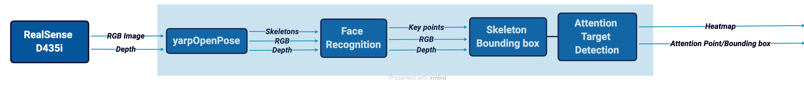

# Developing The Demo Code with YARP
## Table of Contents
  - [Road Map](#road-map)
  - [Code Modification](#code-modification)
    - [Structure](#structure)
    - [YARP Involved](#yarp-involved)
    - [`configure` function](#configure-function)
  - [Data Dump](#data-dump)
  

## Road Map
This step is to complete the final goal, which is to make the whole process online. Since the [offline version](https://github.com/shivahanifi/visual-targets/tree/main/Demo/VT_Demo_Dev_Offline) was successful, here the aim is to involve YARP middleware and run the demo online. 

## Code Modification
### Structure
In oredr to make the code more professional and less confusing, I have followed the structures in [face-recogniser-demo](https://github.com/MariaLombardi/face-recogniser-demo), [leftright-gaze-estimator-demo](https://github.com/MariaLombardi/leftright-gaze-estimator-demo) and [mutual-gaze-classifier-demo](https://github.com/MariaLombardi/mutual-gaze-classifier-demo) repositories.  The constant variables and configuration-related information have been placed in `config_vt.py` file. Additionaly, the functions are defined in the file `utilities_vt.py` and imported to the main demo file when needed. 

The repository contains the `src` folder which includes the main Python code for the demo and the `utilities_vt.py` and `config_vt.py` files. There is also the `app` folder which contains the application XML files for the demo in the  `scripts` and also the initialization files in the `config`. 

- Note: The original code from [attention-target-detection](https://github.com/ejcgt/attention-target-detection) repository has its own `config` and `utils`. However, it is better not to merge them for the sake of debugging and understandability.

### YARP Involved
In oredr to make the process online, such that it recieves the RGB images from the RealSense camera and processes it through the code and outputs the attention maps in the real time, YARP needs to be involved. To do so, the first step is to call the method `yarp.Network.init()`. This method performs the start-up tasks and includes utilities for manipulating the YARP network, including initialization and shotdown.

### `configure` function
Here all the things that need to be run just once are placed. It contains the input/output ports and the part of the main that does not need to be run in a loop (for example the parser).

## Data Dump
To frequently test the code, we dumped data using the RealSense camera on the iCub and a `yarpdatadumper`. 3 dumpers were used to dump the RGB image, depth and skeleton which is the output of the openpose. Two different sequences of data were collected. You can find them in [VTD_dumper]().

- Note: OpenPose is sensitive and it randomly selects the people in the scene and outputs the skeleton. With the second sequence of data we tried to close the door and avoid problems better.