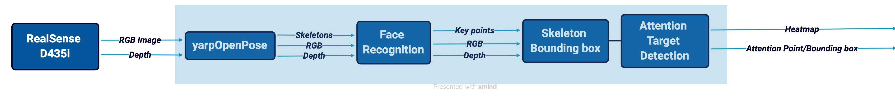
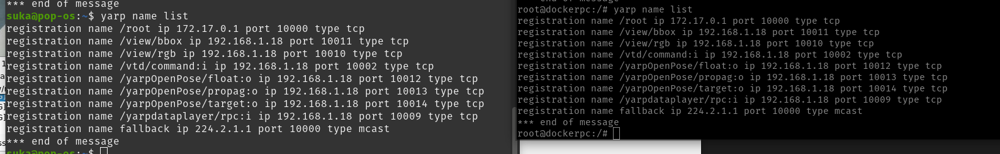

# Developing The Demo Code with YARP
## Table of Contents
  - [Road Map](#road-map)
  - [Data Dump](#data-dump)
  - [Code Modification](#code-modification)
    - [Structure](#structure)
    - [Errors & Attempts](#errors--attempts)
  - [How to Run the Code](#how-to-run-the-code)
  - [Test w/ Dumped Data](#test-w-dumped-data)
  - [Test Simplified Versions](#test-simplified-versions)
  

## Road Map
This step is to complete the final goal, which is to make the whole process online. Since the [offline version](https://github.com/shivahanifi/visual-targets/tree/main/Demo/VT_Demo_Dev_Offline) was successful, here the aim is to involve YARP middleware and run the demo online. 



## Data Dump
To frequently test the code, we dumped data using the RealSense camera on the iCub and a `yarpdatadumper`. We had dumped data previously, while [collecting custom input](https://github.com/shivahanifi/visual-targets/tree/main/Demo/VT_Demo_CustomInput/VT_CI_Collection). Here 3 dumpers were used to dump the RGB image, depth and skeleton which is the output of the openpose. Two different sequences of data were collected. You can find them in [VTD_dumper]().

- Note: OpenPose is sensitive and it randomly selects the people in the scene and outputs the skeleton. With the second sequence of data we tried to close the door and avoid problems better.

## Code Modification
### Structure
In oredr to make the code more professional and less confusing, I have followed the structures in [face-recogniser-demo](https://github.com/MariaLombardi/face-recogniser-demo), [leftright-gaze-estimator-demo](https://github.com/MariaLombardi/leftright-gaze-estimator-demo) and [mutual-gaze-classifier-demo](https://github.com/MariaLombardi/mutual-gaze-classifier-demo) repositories.  The constant variables and configuration-related information have been placed in `config_vt.py` file. Additionaly, the functions are defined in the file `utilities_vt.py` and imported to the main demo file when needed. 

The repository contains the `src` folder which includes the main Python code for the demo and the `utilities_vt.py` and `config_vt.py` files inside the `functions` folder. Additionally, all the code and data from the [attention-target-detection](https://github.com/ejcgt/attention-target-detection) repository are placed inside this repo, such that the code have access to all the subfiles it needs. There is also the `app` folder which contains the application XML files for the demo in the  `scripts` and also the initialization files in the `config`. 

- Note: The original code from [attention-target-detection](https://github.com/ejcgt/attention-target-detection) repository has its own `config` and `utils`. However, it is better not to merge them for the sake of debugging and understandability.
  

### ERRORS & Attempts

Up to this point in the project, in order to run the demo, the environment provided by [attention-target-detection](https://github.com/ejcgt/attention-target-detection) was being used and when YARP needed (i.e. to dump test data, etc) a docker provided by [mutual-gaze-classifier-demo](https://github.com/MariaLombardi/mutual-gaze-classifier-demo/tree/main/app/demo_docker) was involved. However, it is not possible to use them simultaneously. I faced several errors when importing YARP and using it together with the environment. 

1. DELL laptop has a problem with `SWIG`. it cannot find the `swig4.1.1` and therefor faces errors while installing robotology-superbuild.

  - I tried to install SWIG both in the environment and outside of it. Also tried to change the SWIG direction from cmake but non of them worked. 
  - Also tried to build robotology-superbuild while in the environment using the command:
   ```
   conda install -c conda-forge -c robotology python=3.5
   ``` 
  It didn't work either!

2. With the msi laptop I installed robotology-superbuild successfully on the other environment but [attention-target-detection](https://github.com/ejcgt/attention-target-detection)'s environment was not able to detect it. I was recieving an error related to GlibC

3. Build robotology-superbuild while in the environment

<mark>Solution</mark>

The above mentioned errors could not be resolved. The final solution was to build a docker from the [docker file](https://github.com/shivahanifi/online-visual-target-detection/tree/main/demo_docker) and create the conda environment inside the docker. Information on how to build and run the docker file can be found [here](https://github.com/shivahanifi/online-visual-target-detection/blob/main/demo_docker/README.md).

## How to Run The Code
Follow the steps below to run the code.

1. Run the docker
    ```
    xhost +

    sudo nvidia-docker run --rm -it --privileged --gpus all  --privileged -v /dev:/dev -e QT_X11_NO_MITSHM=1 -e DISPLAY -v /tmp/.X11-unix:/tmp/.X11-unix --hostname dockerpc --network=host --pid=host visual_target_attention bash
    ```
2. Activate the Conda environment inside the docker
    ```
    source activate myenv-vtd
    ```
    - Note: The commands to create the environment inside the docker are already placed inside the [docker file](https://github.com/shivahanifi/online-visual-target-detection/blob/main/demo_docker/Dockerfile), and you don't need to build it separately.

3. Clone your repository inside the docker
    ```
    cd projects

    git clone https://github.com/shivahanifi/online-visual-target-detection.git
    ```

4. Open a new terminal inside the docker and run `yarpserver` since our code involves YARP
    ```
    docker exec -it <id_container> bash

    yarpserver
    ```

5. Head to where your code is and run it
    ```
    cd online-visual-target-detection/src/

    python demo_dev_online.py
    ```
You should see that the ports you have defined inside the code are opened and working properly.

## Test w/ Dumped Data
Inorder to use the previously dumped data, `yarpdatapalyer` will be used. It will play the data as if they are streaming from a camera. Inside the docker, there was an error related to QT libraries which caused problems when trying to open a yarpview and visualize the data. To overcome this issue we are using the yarpview and the yarpdataplayer from the yarp installed on the localhost. An [application XML file](https://github.com/shivahanifi/online-visual-target-detection/blob/main/app/scripts/vtd_app.xml) is created such that connects the ports from the code inside the docker with the dataplayer and the yarpview on the localhost (we are treating them as two different machines running on the same nameserver).

Steps to test the dumped-data:
1. Run the docker
2. Run `yarpserver` inside the docker
3. Run the code inside the docker
4. Run `yarpmanager` on the localhost
5. Load the application XML file to the yarpmanager and run the modules. 
6. In the opened `yarpdataplayer` module upload the dumped-data and play the data.
7. Connect all the modules to get the output.

<ins>Note 1</ins>: 

When running the dataplayer, first load one of the sequences of the dumped-data (from file), then in our case we do not need depth therefore disable it. Finally, before playing, choose repeating from options so that it will continuosly play the data.

<ins>Note 2</ins>: 

You can test if the localhost can see the yarpserver with `yarp detect`. This command shows where yarpserver is running.


  As you can see from the pictures, local host can see the yarpserver with the same IP and port as the server is running on the docker. If it cannot see the server you can use the command below to make it find a specific server:

  ```
    yarp conf <IP>  <Port>
  ```

<ins>Note 3</ins>: 

Test if both the docker and the localhost can see the same ports with the `yarp name list` command.



## Test Simplified Versions
Related code for each step can be found in [dev_online_code_explained.md](https://github.com/shivahanifi/online-visual-target-detection/blob/main/src/dev_online_code_explained.md).
1. Copy input into output

    This is a simple test just to see if we can successfully send the input image to the output port without any change and visualize it. The result was displaying the same frames both in the input and output.
      
      

2. Visualize only the boundingbox

    With the second test the aim is to draw the head bounding boxes for the dumped data.
   A sample frame from the results is presented.

      

    - Note 1: The same application XML file was used, no need for any changes.

    - Note 2: The results were being displayed with a bit of a lag with respect to the inputs, which is due to the GPU. With an external GPU the problem will be solved.

3. Visualize the heatmap and the boundingbox
This is the final step and the goal is to integrate all parts of the module. The result for this part is shown below:

    

    - Note: The `self.args.vis_mode == 'arrow'` mode is not on and we are using the heatmap to visualize attention, but the code for the arrow mode has also been updated and rewritten with openCv. (This part has not been tested.)
