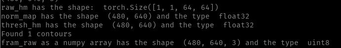
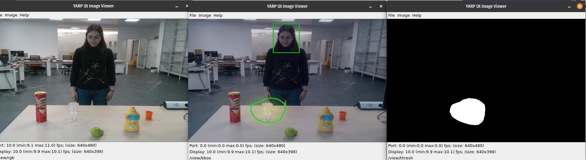
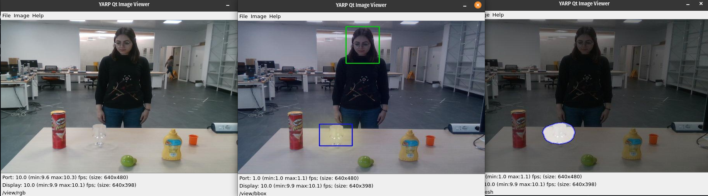
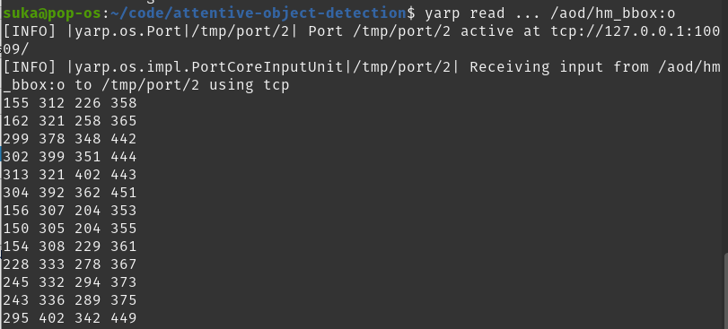

This is to clearly explain the modifications of the [online-vtd](https://github.com/shivahanifi/online-visual-target-detection/blob/main/src/demo_dev_online.py). 

## Table of Contents
- [Recap](#recap)
- [Goal](#goal)
- [Approach](#approach)
- [Errors](#errors)
- [Visualization](#visualization)
- [Bounding box information](#bounding-box-information)

                                   
## Recap
The previous explanations of this code can be used for understanding of the first part ([dev_online_code_explained.md](https://github.com/shivahanifi/online-visual-target-detection/blob/main/src/dev_online_code_explained.md),  [VT_Demo_Code.md](https://github.com/shivahanifi/visual-targets/blob/main/Demo/VT_Demo_Code.md)). Here only the modifications will be explained.

## Goal
The goal is to extract the bounding box of the concentrated area in the heatmap. This bounding box will be presented as output both visually and in an array form.

## Approach
- Thresholding

  The concept of thresholding will be used to extract the bounding box of the visually attended area. OpenCV has a specific function `cv.threshold` to apply the thresholding.

  The matter is straight-forward. For every pixel, the same threshold value is applied. If the pixel value is smaller than the threshold, it is set to 0, otherwise it is set to a maximum value.

  ```
  cv.threshold(src, thresh, maxval, type[, dst]) 
  ```
  - `src`: source image, which should be a grayscale image. 
  - `thresh`: threshold value which is used to classify the pixel values.
  - `maxval`: maximum value which is assigned to pixel values exceeding the threshold.
  - OpenCV provides different types of thresholding which is given by the fourth parameter of the function. The thresholding types include:
    1. cv.THRESH_BINARY
    2. cv.THRESH_BINARY_INV
    3. cv.THRESH_TRUNC
    4. cv.THRESH_TOZERO
    5. cv.THRESH_TOZERO_INV

  The method returns two outputs. The first is the threshold that was used and the second output is the thresholded image.
  In this example, we start by loading an image and converting it to grayscale. We then apply a threshold to create a binary image where all pixels above the threshold are white and all pixels below the threshold are black.

  Next, we use cv2.findContours() to find contours in the binary image. We loop over each contour and use cv2.contourArea() to check if the contour is large enough to be considered a valid region (you can adjust the threshold to your liking).

  For each valid contour, we use cv2.boundingRect() to get the bounding box coordinates. We also set the contour pixels to white in a mask image using the cv2.drawContours() function.

  Finally, we draw a green rectangle around each valid contour on the original image using cv2.rectangle(), but we only draw the rectangle where the corresponding pixels are white in the mask image. This ensures that the bounding boxes only appear around the white areas in the image.

  We then display the image with bounding boxes using cv2.imshow() and wait for a key press before closing the window.

- Contour Features

  Contours can be explained simply as a curve joining all the continuous points (along the boundary), having same color or intensity. The contours are a useful tool for shape analysis and object detection and recognition. In OpenCV, finding contours is like finding white object from black background. So remember, object to be found should be white and background should be black.
  ```
  cv.findContours(image, mode, method[, contours[, hierarchy[, offset]]])
  ```
  - `image`: source image
  - `mode`: contour retrieval mode

    1. `cv.RETR_EXTERNAL`: retrieves only the extreme outer contours. It sets hierarchy[i][2]=hierarchy[i][3]=-1 for all the contours. 
    2. `cv.RETR_LIST`: 	retrieves all of the contours without establishing any hierarchical relationships. 
    3. `cv.RETR_CCOMP`: retrieves all of the contours and organizes them into a two-level hierarchy.
    4. `cv.RETR_TREE`: retrieves all of the contours and reconstructs a full hierarchy of nested contours. 
    5. ` cv.RETR_FLOODFILL`

  - `method` : contour approximation method.
    
    1.  `cv.CHAIN_APPROX_NONE`: stores absolutely all the contour points. That is, any 2 subsequent points (x1,y1) and (x2,y2) of the contour will be either horizontal, vertical or diagonal neighbors, that is, max(abs(x1-x2),abs(y2-y1))==1.
    2. `cv.CHAIN_APPROX_SIMPLE`: compresses horizontal, vertical, and diagonal segments and leaves only their end points. For example, an up-right rectangular contour is encoded with 4 points. 
    3. `cv.CHAIN_APPROX_TC89_L1`
    4. `cv.CHAIN_APPROX_TC89_KCOS`


  It outputs the contours and hierarchy. Contours is a Python list of all the contours in the image. Each individual contour is a Numpy array of (x,y) coordinates of boundary points of the object. hierarchy contains information about the image topology. It has as many elements as the number of contours.

- Drawing Contours
  ```
  cv.drawContours(image, contours, contourIdx, color[, thickness[, lineType[, hierarchy[, maxLevel[, offset]]]]])
  ```
  It can also be used to draw any shape provided you have its boundary points.
  - `image`: source image
  - `contours`: the contours which should be passed as a Python list
  - `contourIdx`: index of contours (useful when drawing individual contour. To draw all contours, pass -1)
  - Remaining arguments are color, thickness etc

-  Bounding Rectangle 
    There are two types of bounding rectangles:
    1. Straight Bounding Rectangle

        It doesn't consider the rotation of the object. So area of the bounding rectangle won't be minimum.
        ```
        cv.boundingRect(array)
        ```
    2. Rotated Rectangle
    
        Here, bounding rectangle is drawn with minimum area, so it considers the rotation also. 
        ```
        cv.minAreaRect(points)
        ```
        It returns a Box2D structure which contains following details - ( center (x,y), (width, height), angle of rotation ).


## Errors
1. YARP (namespace, detect, ports)

    For errors such as not detecting the YARP or ports or connection make sure to check the `yarp namespace` for both the docker and local machine to be the same. (After using it with iCub you need to change them back to the root). You may also use `yarp detect` to make sure the local machine can find YARP. A final check would be to check the visibility of ports by `yarp name list`.

<mark>Using the heatmap with values 0-1</mark>

2. `Unexpected error!!! src is not a numpy array, neither a scalar`
  
    Using the `raw_hm` which is the direct output of the model was causing this error since it was not converted to a Numpy array. using it after being converted to Numpy solved the problem.

<mark>Using the heatmap with values 0-255</mark>

3. `OpenCV Error: Unsupported format or combination of formats ([Start]FindContours supports only CV_8UC1 images when mode != CV_RETR_FLOODFILL otherwise supports CV_32SC1 images only)`

    This error message suggests that there is an issue with the format or combination of formats of the image being processed by the "FindContours" function in OpenCV. 

    Considering what is written in the error message, the image format should be `CV_8UC1` in our case. However, the shape and type of the source image for `cv2.findContours` is as below:
    ```
      print(thresh_hm.shape) #(64,64)
      print(thresh_hm.dtype) #float32
    ```
    To convert an image of dtype float32 to the CV_8UC1 format in OpenCV, you need to first scale the pixel values to the range [0, 255], and then convert the data type to uint8 using the astype() method. Considering this I will discard the 0-1 values for the heatmap, and use the 0-255 from now on. The error was solved using `raw_hm_sq_255` for thresholding and the `thresh_hm.astype(np.uint8)` as the source image.
4. `Unexpected error!!! too many values to unpack (expected 2)`

    The error can occur when calling the `cv2.findContours()` function if the version of OpenCV being used returns a different number of values than expected. In older versions of OpenCV (prior to version 4.0), the `cv2.findContours()` function returned two values: contours and hierarchy. However, in newer versions of OpenCV (version 4.0 and later), `cv2.findContours()` only returns one value: contours. In this case, I modified the code to handle both cases using an if statement to check the number of values returned by `cv2.findContours()`. This approach should work for both newer and older versions of OpenCV.
5. No error, but no boundin box for the objects
6. `OpenCV Error: Assertion failed (npoints >= 0 && (depth == CV_32F || depth == CV_32S)) in contourArea`
    
    Trying to draw just one contour using the maximum contour area ended in this error. It is indicating that there is an assertion failure in the "contourArea" function of the OpenCV library.

    An assertion is a statement in the code that the programmer believes to be true at that point in the program's execution. When an assertion fails, it means that the assumption made by the programmer is incorrect, and the program cannot continue executing. The reason might be that the data type of the input contour is not CV_32F or CV_32S. The function requires the input contour data to be in either single-precision floating-point format (CV_32F) or 32-bit signed integer format (CV_32S).

<mark>Errors Solved</mark>    
In order to solve the error, I changed the code to first get the output of the thresholded heatmap, and then draw the contour as it is. I recognized that the value `contours` was reflecting the exact shape and data type as the input image, which is wrong. This was due to considring only one or two outputs for the `cv2.findContours` function. Replacing it with the code below solved the problem.
```
  _, contours, _ = cv2.findContours(thresh_hm.astype(np.uint8), cv2.RETR_EXTERNAL, cv2.CHAIN_APPROX_SIMPLE)
                                print("Found", len(contours), "contours")
``` 
For drawing the contours I used: 
```
hm_bbox = cv2.drawContours(np.asarray(frame_raw), contours, -1, (0, 255, 0), 2)
```

Printing some of the important information resulted in:



## Visualization

- Contour

  In order to visualize the thresholded heatmap, I defined another port called `/aod/thresh:o` and connected it to another `yarp view` module. The related code:
  ```
  # Visualizing the thresholded Heatmap
  thresh_hm_array = np.asarray(cv2.cvtColor(thresh_hm, cv2.COLOR_GRAY2BGR))
  self.out_buf_thresh_array[:, :] = thresh_hm_array
  self.out_port_thresh_image.write(self.out_buf_thresh_image)
  ```

  

- Bounding box  

  Since the final goal is to extract the bounding box of the objects that are attented visually, the `cv2.boundingRect` method is used to draw the bounding box arround the maximum contour area. The bounding box visualization is added to the main output along with the head bounding box and attention heatmap. In addition, a combination of the raw frame and thresholded heatmap plus the co ntour drawing is being visualized on the `/view/thresh`. 

  

  NOTE: To have a better fitting bounding box the thresholding values has been changed from 100 t0 140. The bigger the value, the smaller the area thresholded and the smaller bounding box will be created.

## Bounding box information

We need the information related to the bounding box of the heatmap to compare it with the output of the object detection module. The output of both the object detection module and the `cv2.rectangle` will have the form:


To make the comparison easier we will try to put the data on the output port in the same order. An output port `/aod/hm_bbox:o` is created and a bottle containing the information of the heatmap bounding box is written on it. Reading this port with:
```
yarp read ... /aod/hm_bbox:o 
```
resulted in:



## Propagation

The input image to the module is also propagated the way it is to be used in the final module.
