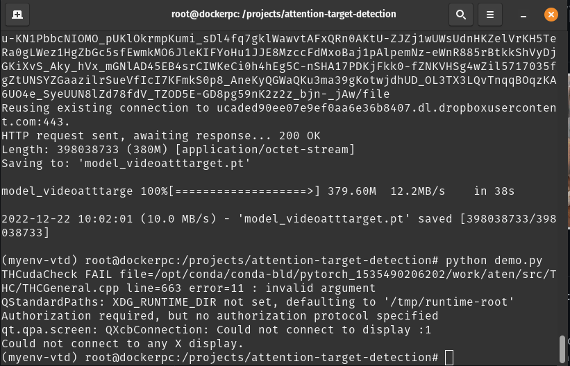

## Table of Contents
  - [What is Docker?](#what-is-docker)
  - [Why you need Docker with this code?](#why-you-need-docker-with-this-code)
  - [The Errors](#the-errors)
  - [Final Solution](#final-solution)
  - [How to build the docker?](#how-to-build-the-docker)
  - [How to run the docker?](#how-to-run-the-docker)


## What is Docker?
Docker is a tool which is used to automate the deployment of applications in lightweight containers so that applications can work efficiently in different environments. You can find the detailed explanation of Docker in the related Xmind file, and also this [video](https://www.youtube.com/watch?v=3c-iBn73dDE) will be helpful. In simple words, its role is the same as the conda environment that I was creating to run the [attention-target-detection demo](https://github.com/ejcgt/attention-target-detection).

## Why you need Docker with this code?
In generall, it is good to create a docker/conda environment in which your code runs perfectly and provide it together with your code. However, in my case it was a necessity to create one. The problem was that the [conda environment](https://github.com/ejcgt/attention-target-detection/blob/master/environment.yml) provided for the source code, utilizes old versions of the most of the packages. To be more clear, it runs the code with the python 3.5.6 and pytorch 0.4.1 which are pretty old versions. This was not a problem running the code alone, however, the problems emerged when I tried to use thid code with YARP. This step is a necessary since it makes the code online and the only way for the code to be able to interact with the iCub is to get wrapped with YARP. After long long try and fails :) the ultimate solution found.

## The Errors
  1. Install YARP separately and run it inside the conda environment
       
      It did not work properly since YARP was using the latest python version and could not idntify the python version specified inside the environment. The attempts to make YARP see the python 3.5 was not successful. In the YARP documentations there is a solution to make YARP use specific version of the python specifying it in the variable `YARP_USE_PYTHON_VERSION`, but we could not find this variable in any of the cmake files.
  2. A docker image with ubuntu 16

    Using a docker with ubuntu16, python3.5 and YARP 3.4 did not work. There was errors while building the docker.


## Final Solution
The final solution was to build a docker starting from ubuntu 18 with python 3.6 which can also see python 3.5, the YARP with latest version, Anaconda and also clone the repository [attention-target-detection demo](https://github.com/ejcgt/attention-target-detection). After building the docker, create the environment related to the .yml file and run the basic demo code. It was successful up to this point.
- Run on CPU
    
  Since nvidia-docker was not installed and the docker environment was not able to see the GPU first I run it only on CPU to test (To do so remove the `.cuda()` whereever you see it in the demo.py code).

## How to build the docker?

To build the docker head to the direction where you have your docker file and use the command below:
```
sudo docker build --build-arg "START_IMG=nvidia/cuda:10.0-cudnn7-devel-ubuntu18.04" --build-arg "release=master" --build-arg "sbtag=Unstable" -t visual_target_attention .
```
Here we are using `sudo` since there was an accessibility error when trying to build w/o sudo. Using the `--build-arg` we are setting build-time variables, i.e. specify the image it should start from. Also the tag name for this docker is specified as `visual_target_attention`. The docker file that it is getting built is included in the folder under the name [Dockerfile]().

## How to run the docker?
Before running the docker you should do:
```
xhost +
```
It adds host names on the list of machines from which the X Server accepts connections. This command must be run from the machine with the display connection. This permits the root user on the local machine to connect to X windows display. In case you do not run this, you will face this error:



After that you can run the docker:

```
sudo nvidia-docker run --rm -it --privileged --gpus all  --privileged -v /dev:/dev -e QT_X11_NO_MITSHM=1 -e DISPLAY -v /tmp/.X11-unix:/tmp/.X11-unix --hostname dockerpc --network=host --pid=host visual_target_attention bash

```

## Run another terminal inside the docker

In anew terminal get the ID for your docker using the command `docker ps`, and then run it using:
```
docker exec -it <id_container> bash
```