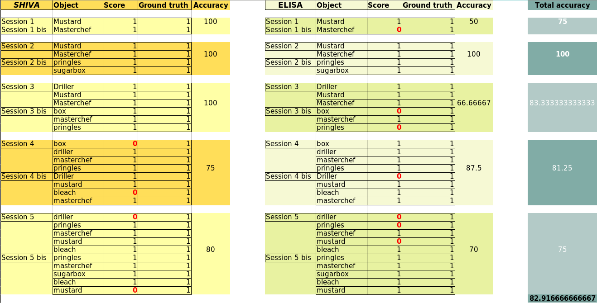
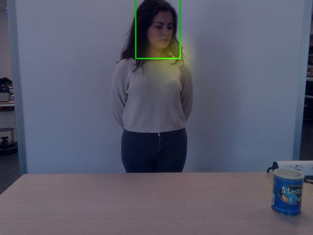
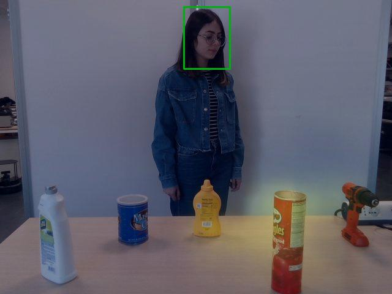

# Tests on iCub with online VTD
With these experiments we are trying to collect insight on the performance of the module up to this point.

## Table of content
1. [Experiment Setting](#experiment-setting)
2. [Observations](#observations)
3. [Data Dump](#data-dump)
4. [Reproduction](#reproduction)

## Experiment Setting
There will be one session for each setting for each person. For each object a 5 second gaze-period is planned and the prediction will be taken for the last frame. The reason for this choice is that the code is using an LSTM structure which benefits from memory and past frames, therefore, the prediction for the last frame would be more precise. 

- Objects

    6 different objects are being used in different settings. These objects are the ones that object detection module has already been trained on.
    
    Mustard, Masterchef, Pringles, Box, Driller, Bleach
    
- Sessions

    We run several experiments starting from one object in the scene and increasing the number of objects up to 5. Two separate experiments are being run for each number of objects in the scene and each time the objects and their placement is changing to have a better understanding of the performance. Data is collected for two different people.

- Scoring

    A binary scoring struccture is used to have an understanding of the performance. i.e. If the module can predict the visually attended object correctly, the score will be 1, otherwise it is 0. 

- Result

     

## Observations
1. The module is less accurate when the visually attended area is on the outer left side of the scene. To be more clear, out of 11 error cases, 6 are related to this situation (% 54.54).

    ( e.g. `session1-elisa-masterchef`, `session3-elisa-box`, `session4-shiva-box`, `session4-elisa-driller`, `session5-shiva-driller`, `session5-elisa-driller`)

    

    

2. Errors have occured with all the objects at least one time, which indicates that the type, size, and color of the object is not affecting the output.
    - NOTE: The objects used in these experiments do not differ in size a lot. However, in the previous experiments it was observed that an object with a larger surface captures the attention and leads to error. (e.g. the case of cracker box and strawberry).

3. Turning the torso together with the head and eyes affects the prediction in a good way.
4. Blinking, chewing, and all the gestures that may affect the bounding box prediction with the OpenPose also affects the output of the online-vtd.
5. When placing the objects, if they are so close and there is a partial occlusion the error rate gets higher. Specifically, left border of each object is more sensitive and prone to errors.
6. Depth information is used in the main module but not provided in the demo code that we are using, and it affects the accuracy of the module.

## Data Dump
Data used in this experiment will also be dumped for the sake of future experiments when adding object detection pipeline.

Download links:

[VTD_dumper_Shiva.zip](https://drive.google.com/uc?export=download&id=1OcGZz11U54KtC5uB9VJXhHEm9KbYNzEl)

[VTD_dumper_Elisa.zip](https://drive.google.com/uc?export=download&id=1qqfrwu0lMbRjVL5B-GEyQRn1gFfDb4s2)

The dumped data will include:
1. RGB image (Propagated through VTD)
2. Output of the module


## Reproduction
In order to reproduce this experiment, you will need to follow these steps:
1.  build the docker from the [online-visual-target-detection](https://github.com/shivahanifi/online-visual-target-detection/tree/main/demo_docker) repository in the machine you want to use (Note that a a powerfull GPU is required). 
2. Run the docker and activate the conda environment inside the docker.
```
source activate myenv-vtd
```
3. Run the VTD module. i.e. `demo_dev_online.py` 
3. `yarpOpenPose` module should also be running (preferably on another machine).
3. Make sure the `yarp namespace` for the machines you are using and the icub are the same.
4. Run the application XML file [visual-target-detection-online.xml](https://github.com/shivahanifi/online-visual-target-detection/blob/main/app/scripts/visual-target-detection-online.xml) with `yarpmanager`, and connect all the modules.    