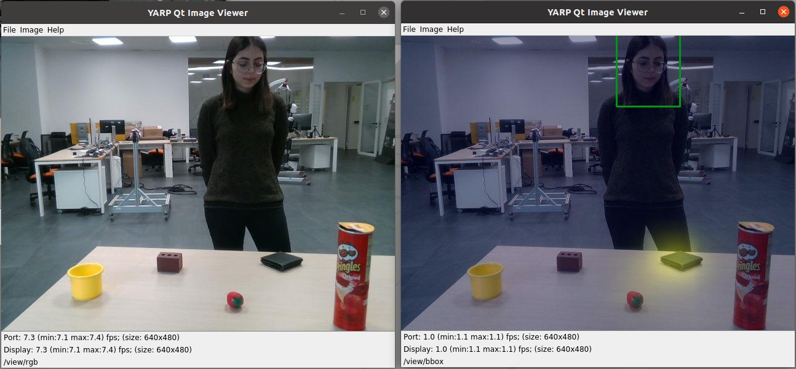
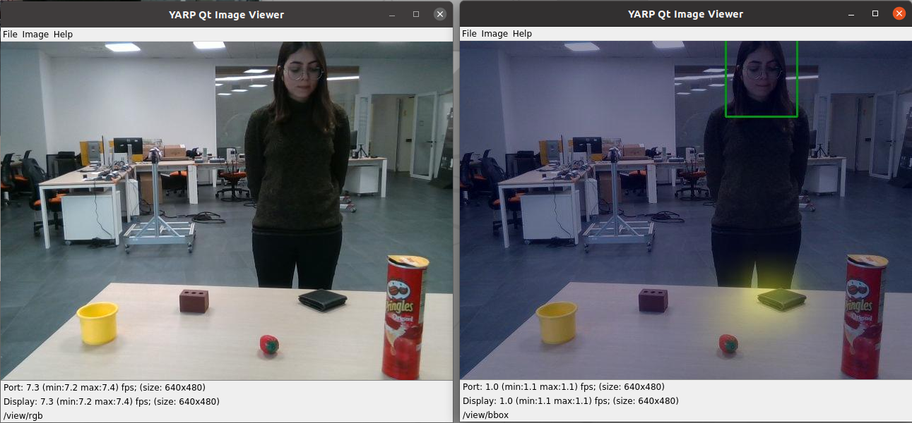
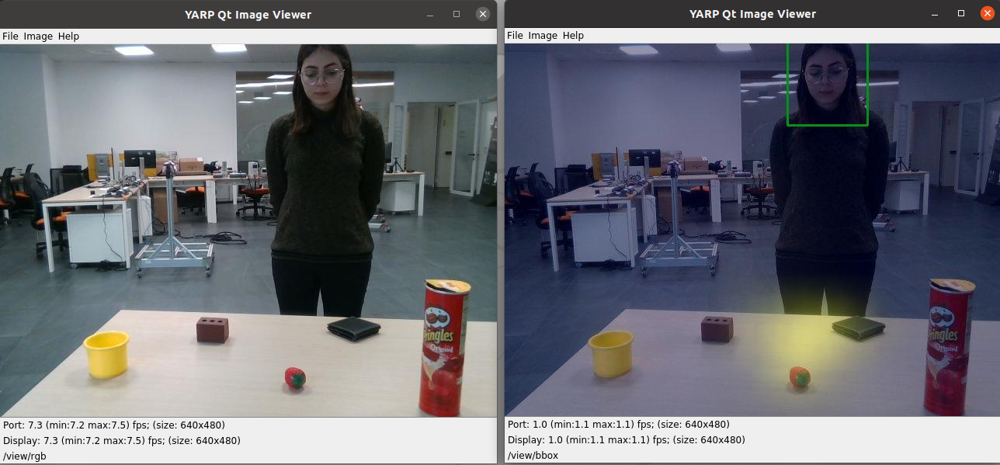
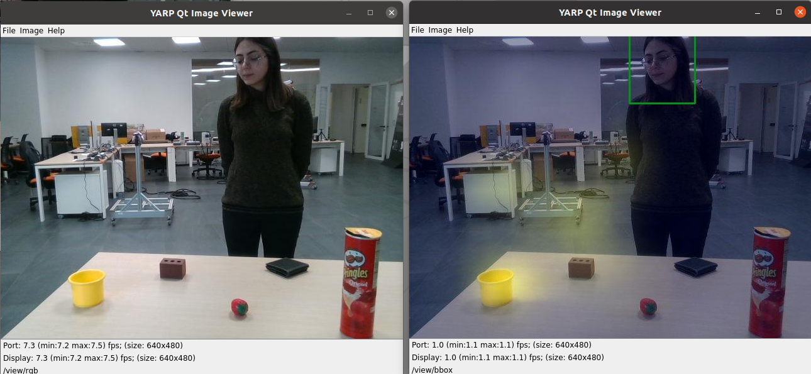

# Preliminary Test With iCub

https://user-images.githubusercontent.com/78621902/220599778-48063bd9-4c7d-4db0-8f78-88809adb1ce2.mp4

## Run machines on the same server
1. This is the first step to connect the machine that the code is runing on and the iCub. To do so, they should be runnning on the same Yarp name space. Eventhough we connect the machine with code physically to the same network that iCub is on (with LAN), we check the `yarp namespace` on the machine. In our case it was `root`, and we had to change it to the one in the iCub's system.

    ```
    yarp namespace /icub01
    ```
2. With `yarp detect` check if the machine can find the name space.
3. Try `yarp detect --write` not to do the same things everytime.
4. Now, running `yarp name list`, you should see all the ports related to iCub

## Changes in the XML application file
There should be few changes with respect to the XML application file used in the tests with dumped data. Here the input images will be recieved from the RealSense camera on the iCub. Also OpenPose will be running as a seperate module (with dumped data we had OpenPose data dumped already). You can see below the changes applieed. The related file is [visual-target-detection-online.xml](https://github.com/shivahanifi/online-visual-target-detection/blob/main/app/scripts/visual-target-detection-online.xml)
```
	<module>
		<name>yarpdev</name>
		<parameters>--context realsense --from realsense2Conf_640_480.ini</parameters>
		<node>iiticublap235</node>
	</module>

	<module>
		<name>yarpOpenPose</name>
		<parameters>--from /home/icub/shared/conf/yarpOpenPose.ini</parameters>
		<node>docker-mg</node>
	</module>
```
After applying the changes, run `yarpmanager` on the local machine and connect the ports to just see if the OpenPose works properly and can propagate the images and display them on yarpview. 

In our case, there was a problem with the GPU. the msi laptop could not be connected to the eGPU because of the thunderbolt ports problem. On the other hand, iCub's machine without external GPU was not able to run the OpenPose properly. To that end, an external GPU was connected to the iCub's system and OpenPose was being run from the docker on that machine.

## Activate your docker and run the code
The final step is to activat the docker and conda environment as did before to test with the dumped data. Run the code and connect the ports to see the result.

## Test setup and results
Here we are using five objects (cracker box, wallet, strawberry, brown cube, yellow cup). The result for each of them are presente below.

- Note: Since the main code was running on the machine with no eGPU, still the output was lagging and they were collected by focusing around 15 seconds on each object. (To solve this problem we are planning to install the docker related to the code to iCub's machine in order to use eGPU.)

	<mark>Person looking at the cracker box</mark>
	

	<mark>Person looking at the wallet</mark>
	

	<mark>Person looking at the strawberry</mark>
	 

	<mark>Person looking at the brown cube</mark>
	 

	<mark>Person looking at the yellow cup</mark>
	 

- Note: To reduce the dominance of the heatmap in visualization, I addjusted the coefficients in the main code when using `cv2.addWeighted` for the heatmap and bounding box image.


