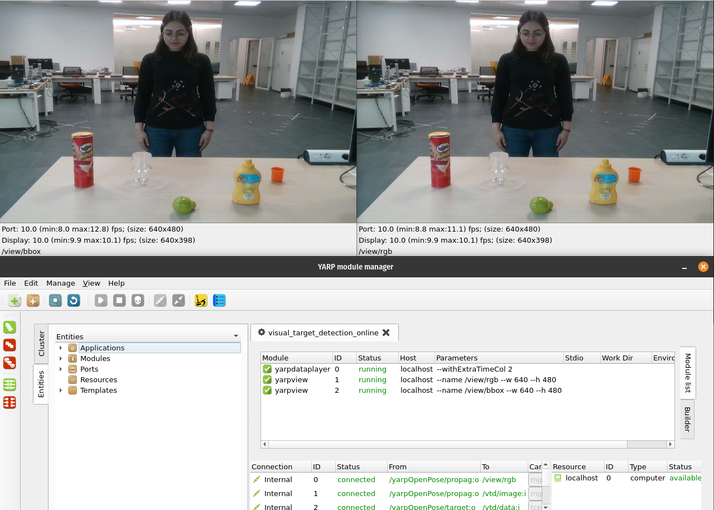
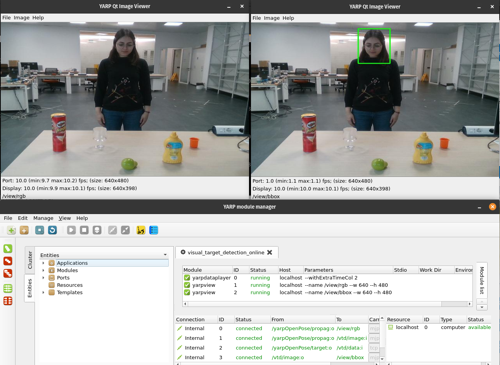
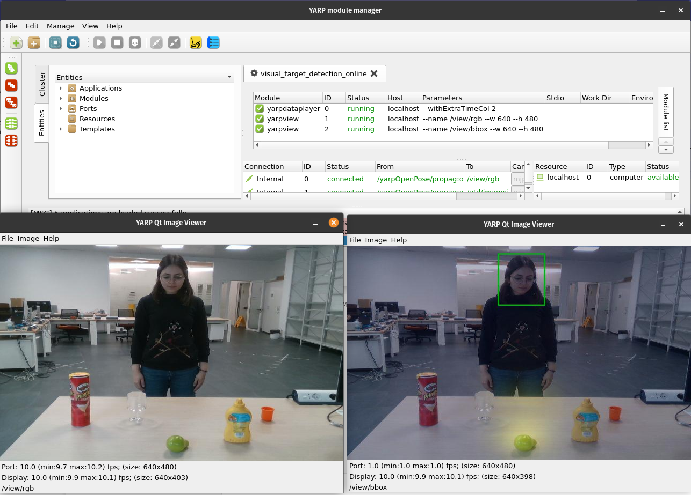

## Table of Contents
- [Class Definition](#class-definition)
- [`configure` Method](#configure-method)
  - [gpu](#gpu)
  - [Ports](#ports)
- [respond Methopd](#respond-methopd)
- [interruptModule Method](#interruptmodule-method)
- [getPeriod Method](#getperiod-method)
- [updateModule Method](#updatemodule-method)
- [Errors](#errors)
- [Test Simplified Versions](#test-simplified-versions)
                                   
## Class Definition
This code is in OOP style, which helps it to be more organized and deals with objects. To that end a class `VisualTargetDetection` is defined. `yarp.RFModule` is used as an input for the class.


## `configure` Method
```
def configure(self,rf):
```
This function can perform initialization including object creation and memory allocation; returns false to notify that initialization was not successful and that the module should not start. 
Note that here all the things that need to be run just once are placed. It contains the input/output ports and the part of the main that does not need to be run in a loop (for example the parser in our case).

It takes `rf` as a parameter as a previously initialized ResourceFinder which is defined at the end of the code as `rf = yarp.ResourceFinder()`. Note that `self` is also a parameter since it is a method inside a class and needs to take self as input.

  ### gpu
  
   ```
      num_gpu = rf.find("num_gpu").asInt32() 
      num_gpu_start = rf.find("num_gpu_start").asInt32()
      print('Num GPU: %d, GPU start: %d' % (num_gpu, num_gpu_start))
      init_gpus(num_gpu, num_gpu_start) 
   ```    
  - `rf.find()`
    
    Gets a value corresponding to a given keyword, `num_gpu`, and Returns
    A value corresponding to the given keyword. If there is no such value, then the isNull() method called on the result will be true. Otherwise, the value can be read by calling result.asInt32(), result.asString(), etc. as appropriate.
  - print w/ format specifier
  
    `%d` specifies the integer format for the number of GPUs when printing.
  - `init_gpus()`
  
    This function is defined in the `utilities_vt.py` file, thus you need to import it inorder to use it. (Note: the main definition is from [face-recogniser-realsense.py](https://github.com/MariaLombardi/face-recogniser-demo/blob/main/src/face-recogniser-realsense.py))
  
  ###   Ports
  - Which ports are need?
    
    Considering the roadmap, ports needed are as follows: 
    
    
1. Input Image port and buffer (Depth is not used in this code and it does not need a port)
2. Input port for openpose data
3. Output port for bboxes
4. Output port for ropagating input image
5. Output port for the selection

  For ports related to the images we will consider two parts, defining the port and preparing the related buffer which needs to be done only once (That's why we are using it in the `config` method). To better understand read [yarpImage](https://github.dev/robotology/yarp/blob/master/bindings/python/examples/yarpImage.py) and [Handling YARP images in Python](https://robotology.github.io/robotology-documentation/doc/html/icub_python_imaging.html).
  
  1. Input port for rgb image
  ```
    self.in_port_human_image = yarp.BufferedPortImageRgb()
    self.in_port_human_image.open('/vtd/image:i')
  ```

  `BufferedPortImageRgb`: The read() method of this class returns a yarp image of an appropriate type, which then must be copied to another yarp image, associated with a NumPy array. Although this introduces one additional copy operation, this facilitates adjusting the receiving NumPy array to potentially changing image size
  2. Preparing input image buffer
  ```
    self.in_buf_human_array = np.ones((IMAGE_HEIGHT, IMAGE_WIDTH, 3), dtype=np.uint8)
    self.in_buf_human_image = yarp.ImageRgb()
    self.in_buf_human_image.resize(IMAGE_WIDTH, IMAGE_HEIGHT)
    self.in_buf_human_image.setExternal(self.in_buf_human_array.data, self.in_buf_human_array.shape[1],
                                        self.in_buf_human_array.shape[0])
    print('{:s} opened'.format('/vtd/image:i'))
  ```
      
   Creates numpy array to receive the image and the YARP image wrapped around it. 
    
  - NumPy array shape, data type and value range must be compatible with the type of YARP image to be wrapped around it. For `yarp.ImageRgb` we have:
     -  `yarp.ImageRgb` - array data type: uint8, shape: (image-height, image-width, 3), values range: 0 to 255
  - `setExternal(data, imgWidth, imgHeight)` method from `yarp::sig::Image` class allows an Image object to "wrap around" an already existing data buffer.

## respond Methopd
RFModule::respond(const Bottle & 	command, Bottle & 	reply)		

Respond to a message. You can override this to respond to messages in your own way. It is useful, if your module doesn't know what to do with a message, to call RFModule::respond() for any default responses.
- Parameters:
  - command:	the message received
  - reply:	the response you wish to make

It returns true if there was no critical failure


## interruptModule Method
RFModule::interruptModule()	

Try to halt any ongoing operations by threads managed by the module. This is called asynchronously just after a quit command is received. By default it does nothing - you may want to override this. If you have created any ports, and have any threads that might be blocked on reading data from those ports, this is a good place to add calls to BufferedPort::interrupt() or Port::interrupt(). It returns true if there was no catastrophic failure
  
## getPeriod Method
  RFModule::getPeriod()	

  You can override this to control the approximate periodicity at which updateModule() is called by runModule().By default, it returns 1.0. Time here is in seconds. It is set to 0.001 seconds in our code.

## updateModule Method
It contains the part of the code that will iterate. Here we include all the steps that we are planning to apply on the input images. Therefore, the base of the code from [Detecting Attended Visual Targets in Video](https://github.com/ejcgt/attention-target-detection)'s demo is modified such that it is applicable in online structure. i.e. it will recieve images from the YARP ports and after processing it will return them to YARP ports as an output.

### Notes
1.  The images recieved from the YARP ports are wrapped in a numpy array format but the code needs them in a PIL format. A transformation should be applied in this sense.
2. Dataframe structure can still remain eventhough we are using one image at a time and there is no need for sorting them in a dataframe, but to save the initial structure it stays and everytime it will use the index 0 of the dataframe.
3. 

## Errors
  1.  [IndentationError: unexpected unindent](https://techwithtech.com/indentationerror-unexpected-unindent/)

      It occured because of the try-except structure. In the update module there is a try, which should have an except pair. Adding the except in the proper place with proper syntax solved the error.
  
  2.  `ImportError: No module named 'lib'`

      It is relate dto the `from lib.pytorch_convolutional_rnn import convolutional_rnn`, There is a folder named `lib` which contains [pytorch_convolutional_rnn](https://github.com/ejcgt/attention-target-detection/tree/master/lib/pytorch_convolutional_rnn). It is a module created by the authors of the original code. The reason for recieving this error was the new structur of files where I have classified them into the `src` and `app`. However, the folder containong the lib was not inside the `src` where the main code is, therefore, it was not able to find it.
      - Note: I moved all the python related codes and folders inside the `src` to avoid any further errors.

  3. `ImportError: No module named 'tensorflow'`
      
      Tensorflow is not installed inside the environment since the main code is not using it. I have used it in the `utilities_vt.py` to define the functions I need. To solve this error install it inside the environment. 
      ```
      pip install tensorflow
      ``` 
  4. `NameError: name 'sys' is not defined`

      It is related to the `rf.configure(sys.argv)`, The error is because I have forgotten to import sys. This module provides access to some variables used or maintained by the interpreter and to functions that interact strongly with the interpreter. It is always available.

## Test Simplified Versions
1. Copy input into output

    This is a simple test just to see if we can successfully send the input image to the output port without any change and visualize it. To do so, comment eveerything in the `updateModule` and only keep:

    ```
      received_image = self.in_port_human_image.read()
      self.in_buf_human_image.copy(received_image)
      assert self.in_buf_human_array.__array_interface__['data'][0] == self.in_buf_human_image.getRawImage().__int__()
      pil_image = PIL.Image.fromarray(self.in_buf_human_array)

      self.out_buf_human_array[:, :] = self.in_buf_human_array
      self.out_port_human_image.write(self.out_buf_human_image)
    ```

    Running this code ended up with visualizing only one frame of the input data in the output view. The `updateModule` should run continuously and not once. Therefore, the problem here should be that it cannot end the first execution and get to the other frames. Adding `return True` at the end of the `updateModule` solved the problem. The result was displaying the same frames both in the input and output.
      

2. Visualize only the boundingbox

    With the second test the aim is to draw the head bounding boxes for the dumped data.
    The dumped input images propagated through yarpOpenPose, for the sake of synchronicity, in the port `/yarpOpenPose/propag:o` will be given as input to the code at the port `/vtd/image:i`. On the other hand, the dumped OpenPose data which is in the port `/yarpOpenPose/target:o` will be fed to the code through the port `/vtd/data:i`. Considering the main code from the [attention-target-detection](https://github.com/ejcgt/attention-target-detection/blob/master/demo.py), there are changes that have been applied. The main change regards the visualization part. In the source demo code they are usig `matplotlib` which makes the code a bit confusing, here I have replaced it with openCV functions. A sample frame from the results is presented.

      

    - Note 1: There were plenty of errors, but all of them were related to the minor details of code such as syntax, typo, etc. The one that is worth highlighting was relatd to adding `return True` at the end of the module so that it will repeat the procedure for all the input images.

    - Note 2: The same application XML file was used, no need for any changes.

    - Note 3: The results were being displayed with a bit of a lag with respect to the inputs, which is due to the GPU. With an external GPU the problem will be solved.
    
    - Note 3: If you want to repeat this step, replace the `updateModule` with the code below.

    ```
        def updateModule(self):
    
        received_image = self.in_port_human_image.read()
        self.in_buf_human_image.copy(received_image)
        assert self.in_buf_human_array.__array_interface__['data'][0] == self.in_buf_human_image.getRawImage().__int__()

        # Convert the numpy array to a PIL image
        pil_image = Image.fromarray(self.in_buf_human_array)
        
       
        # To check the input
        #pil_image.save('/projects/test_images/pil_image.png')

        if pil_image:
            received_data = self.in_port_human_data.read()
            if received_data:
                try:
                    poses, conf_poses, faces, conf_faces = read_openpose_data(received_data)
                
                    if poses:
                        min_x, min_y, max_x, max_y = get_openpose_bbox(poses)

                        column_names = ['left', 'top', 'right', 'bottom']
                        line_to_write = [[min_x, min_y, max_x, max_y]]
                        df = pd.DataFrame(line_to_write, columns=column_names)
    
                        df['left'] -= (df['right']-df['left'])*0.1
                        df['right'] += (df['right']-df['left'])*0.1
                        df['top'] -= (df['bottom']-df['top'])*0.1
                        df['bottom'] += (df['bottom']-df['top'])*0.1


                        # Transforming images
                        def get_transform():
                            transform_list = []
                            transform_list.append(transforms.Resize((input_resolution, input_resolution)))
                            transform_list.append(transforms.ToTensor())
                            transform_list.append(transforms.Normalize(mean=[0.485, 0.456, 0.406], std=[0.229, 0.224, 0.225]))
                            return transforms.Compose(transform_list)


                         #logging.debug(df)
                         # set up data transformation
                        test_transforms = get_transform()

                        model = ModelSpatial()
                        model_dict = model.state_dict()
                        pretrained_dict = torch.load(self.args.model_weights)
                        pretrained_dict = pretrained_dict['model']
                        model_dict.update(pretrained_dict)
                        model.load_state_dict(model_dict)

                        model.cuda()
                        model.train(False)

                        with torch.no_grad():
                            for i in df.index:
                                frame_raw = pil_image
                            
                                width, height = frame_raw.size

                                head_box = [df.loc[i,'left'], df.loc[i,'top'], df.loc[i,'right'], df.loc[i,'bottom']]

                                head = frame_raw.crop((head_box)) # head crop

                                head = test_transforms(head) # transform inputs
                                frame = test_transforms(frame_raw)
                                head_channel = imutils.get_head_box_channel(head_box[0], head_box[1], head_box[2], head_box[3], width, height,
                                                                            resolution=input_resolution).unsqueeze(0)

                                head = head.unsqueeze(0).cuda()
                                frame = frame.unsqueeze(0).cuda()
                                head_channel = head_channel.unsqueeze(0).cuda()

                                # forward pass
                                raw_hm, _, inout = model(frame, head_channel, head)

                                # Draw the raw_frame and the bbox
                                start_point = (int(head_box[0]), int(head_box[1]))
                                end_point = (int(head_box[2]), int(head_box[3]))
                                img_bbox = cv2.rectangle(np.asarray(frame_raw),start_point,end_point, (0, 255, 0),2)
                                cv2.imwrite('/projects/test_images/img_bbox.png', img_bbox)
                                #cv2.imshow('bbox', img_bbox)
                                #cv2.waitKey(0)
                            

                                img_bbox_array = np.asarray(img_bbox)
                                self.out_buf_human_array[:, :] = img_bbox_array
                                self.out_port_human_image.write(self.out_buf_human_image)
                    else:
                        print('Could not get the poses')
                except Exception as err:
                    print("An error occured while extracting the poses from OpenPose data")
                    print("Unexpected error!!! " + str(err))
            else:
                print('No data from OpenPose recieved')
        else:
            print('No input images recieved')    

        return True   
    ```

3. Visualize the heatmap and the boundingbox
This is the final step and the goal is to integrate all parts of the module. In order to visualize the heatmap there were few steps to complete. 

    - The original code was using matplotlib and plotting all the steps separately and finally visualizing all of them on top of each other. However, we wanted to use openCV, as we did in the previous step, and plot the heatmap on the bounding box image we got from the last step.

    - The `norm_map` provided with the original code is a gray scale image with 1 channel and the bounding box image is a RGB image with 3 channels, and it is a problem when trying to blend them.

   The result for this part is shown below:

    

    - Note 1: The `self.args.vis_mode == 'arrow'` mode is not on and we are using the heatmap, but the code for the arrow mode has also updated and rewritten with openCv. (This part has not been tested.)
    
  ### Errors
  1. ` Bad argument (When the input arrays in add/subtract/multiply/divide functions have different types, the output array type must be explicitly specified)`

  I was receiving this error when trying to blend the bounding box image and the heatmap image.

  
  To repeat this step you can replace the `updateModule` with the code below.

  ```
  def updateModule(self):
    
        received_image = self.in_port_human_image.read()
        self.in_buf_human_image.copy(received_image)
        assert self.in_buf_human_array.__array_interface__['data'][0] == self.in_buf_human_image.getRawImage().__int__()

        # Convert the numpy array to a PIL image
        pil_image = Image.fromarray(self.in_buf_human_array)
        
       
        # To check the input
        #pil_image.save('/projects/test_images/pil_image.png')

        if pil_image:
            received_data = self.in_port_human_data.read()
            if received_data:
                try:
                    poses, conf_poses, faces, conf_faces = read_openpose_data(received_data)
                
                    if poses:
                        min_x, min_y, max_x, max_y = get_openpose_bbox(poses)

                        column_names = ['left', 'top', 'right', 'bottom']
                        line_to_write = [[min_x, min_y, max_x, max_y]]
                        df = pd.DataFrame(line_to_write, columns=column_names)
    
                        df['left'] -= (df['right']-df['left'])*0.1
                        df['right'] += (df['right']-df['left'])*0.1
                        df['top'] -= (df['bottom']-df['top'])*0.1
                        df['bottom'] += (df['bottom']-df['top'])*0.1


                        # Transforming images
                        def get_transform():
                            transform_list = []
                            transform_list.append(transforms.Resize((input_resolution, input_resolution)))
                            transform_list.append(transforms.ToTensor())
                            transform_list.append(transforms.Normalize(mean=[0.485, 0.456, 0.406], std=[0.229, 0.224, 0.225]))
                            return transforms.Compose(transform_list)


                         # set up data transformation
                        test_transforms = get_transform()

                        model = ModelSpatial()
                        model_dict = model.state_dict()
                        pretrained_dict = torch.load(self.args.model_weights)
                        pretrained_dict = pretrained_dict['model']
                        model_dict.update(pretrained_dict)
                        model.load_state_dict(model_dict)

                        model.cuda()
                        model.train(False)

                        with torch.no_grad():
                            for i in df.index:
                                frame_raw = pil_image
                            
                                width, height = frame_raw.size

                                head_box = [df.loc[i,'left'], df.loc[i,'top'], df.loc[i,'right'], df.loc[i,'bottom']]

                                head = frame_raw.crop((head_box)) # head crop

                                head = test_transforms(head) # transform inputs
                                frame = test_transforms(frame_raw)
                                head_channel = imutils.get_head_box_channel(head_box[0], head_box[1], head_box[2], head_box[3], width, height,
                                                                            resolution=input_resolution).unsqueeze(0)

                                head = head.unsqueeze(0).cuda()
                                frame = frame.unsqueeze(0).cuda()
                                head_channel = head_channel.unsqueeze(0).cuda()

                                # forward pass
                                raw_hm, _, inout = model(frame, head_channel, head)

                                # heatmap modulation
                                raw_hm = raw_hm.cpu().detach().numpy() * 255
                                raw_hm = raw_hm.squeeze()
                                inout = inout.cpu().detach().numpy()
                                inout = 1 / (1 + np.exp(-inout))
                                inout = (1 - inout) * 255
                                norm_map = imresize(raw_hm, (height, width)) - inout

                                # vis

                                # Draw the raw_frame and the bbox
                                start_point = (int(head_box[0]), int(head_box[1]))
                                end_point = (int(head_box[2]), int(head_box[3]))
                                img_bbox = cv2.rectangle(np.asarray(frame_raw),start_point,end_point, (0, 255, 0),2)                      

                                if self.args.vis_mode == 'arrow':
                                    if inout < self.args.out_threshold: # in-frame gaze
                                        pred_x, pred_y = evaluation.argmax_pts(raw_hm)
                                        norm_p = [pred_x/output_resolution, pred_y/output_resolution]
                                        circs = cv2.circle(img_bbox, (norm_p[0]*width, norm_p[1]*height),  height/50.0, (35, 225, 35), -1)
                                        line = cv2.line(circs, (norm_p[0]*width,(head_box[0]+head_box[2])/2), (norm_p[1]*height,(head_box[1]+head_box[3])/2), (255, 0, 0), 2)

                                        line_array =  np.asarray(line)
                                        self.out_buf_human_array[:, :] = line_array
                                        self.out_port_human_image.write(self.out_buf_human_image)

                                else:

                                    # Convert the norm_map image to a 3-channel image with the 'jet' colormap
                                    norm_map = cv2.merge((norm_map,norm_map))
                                    #print(norm_map.shape) #(480, 640, 2)
                                    jet_map = cv2.applyColorMap(norm_map, cv2.COLORMAP_JET)
                                    # Create an alpha channel with a value of 0.2
                                    alpha = np.ones((norm_map.shape[0], norm_map.shape[1], 1), dtype=np.uint8) * 51
                                    #print(alpha.shape) #(480, 640, 1)
                                    # Stack the jet_map and alpha channels together to create an RGBA image
                                    rgba_map = np.dstack((jet_map, alpha))
                                    #print(rgba_map.shape) #(480, 640, 3)
                                   
                                    #norm_img = cv2.normalize(norm_map, None, 0, 255, cv2.NORM_MINMAX)
                                    #print(norm_img.shape)
                                    #norm_map_rgb = cv2.cvtColor(norm_map,cv2.COLOR_GRAY2RG B) 
                                    #img_jet = cv2.applyColorMap(norm_img, cv2.COLORMAP_JET)
                                    #img_blend = cv2.addWeighted(img_jet, 0.2, norm_map, 0.8, 0)
                                    #img_blend= np.repeat(np.expand_dims(img_blend, axis=2), 3, axis=2)
                                    #img_blend_rgb = cv2.cvtColor(img_blend, cv2.COLOR_GRAY2RGB)

                                    # Display both the bbox and heatmap on the image
                                    img_blend_bbox = cv2.addWeighted(rgba_map, 0.4,  np.asarray(img_bbox), 0.6, 0, dtype=cv2.CV_8U)

                                    # Connect it to the output port
                                    img_blend_array = np.asarray(img_blend_bbox)
                                    self.out_buf_human_array[:, :] = img_blend_array
                                    self.out_port_human_image.write(self.out_buf_human_image)

                except Exception as err:
                    print("An error occured while extracting the poses from OpenPose data")
                    print("Unexpected error!!! " + str(err))
        return True                  
  ```