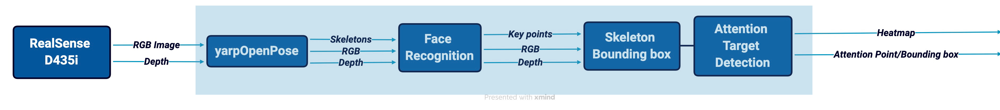

## Table of Contents
- [Table of Contents](#table-of-contents)
- [Imports](#imports)
- [Class Definition](#class-definition)
- [`configure` Method](#configure-method)
  - [gpu](#gpu)
  - [Ports](#ports)
- [respond Methopd](#respond-methopd)
- [interruptModule Method](#interruptmodule-method)
- [getPeriod Method](#getperiod-method)
- [updateModule Method](#updatemodule-method)


## Imports
   1. `yarp`: Needed to initialize the yarp network, define ports, and generally to use YARP.
   2. `numpy`: When defineing ports you need to create a Numpy array to wrap the YARP image.                                     
## Class Definition
This code is in OOP style, which helps it to be more organized and deals with objects. To that end a class `VisualTargetDetection` is defined. `yarp.RFModule` is used as an input for the class.


## `configure` Method
```
def configure(self,rf):
```
This function can perform initialization including object creation and memory allocation; returns false to notify that initialization was not successful and that the module should not start. 
Note that here all the things that need to be run just once are placed. It contains the input/output ports and the part of the main that does not need to be run in a loop (for example the parser in our case).

It takes `rf` as a parameter as a previously initialized ResourceFinder which is defined at the end of the code as `rf = yarp.ResourceFinder()`. Note that `self` is also a parameter since it is a method inside a class and needs to take self as input.

  ### gpu
  
   ```
      num_gpu = rf.find("num_gpu").asInt32() 
      num_gpu_start = rf.find("num_gpu_start").asInt32()
      print('Num GPU: %d, GPU start: %d' % (num_gpu, num_gpu_start))
      init_gpus(num_gpu, num_gpu_start) 
   ```    
  - `rf.find()`
    
    Gets a value corresponding to a given keyword, `num_gpu`, and Returns
    A value corresponding to the given keyword. If there is no such value, then the isNull() method called on the result will be true. Otherwise, the value can be read by calling result.asInt32(), result.asString(), etc. as appropriate.
  - print w/ format specifier
  
    `%d` specifies the integer format for the number of GPUs when printing.
  - `init_gpus()`
  
    This function is defined in the `utilities_vt.py` file, thus you need to import it inorder to use it. (Note: the main definition is from [face-recogniser-realsense.py](https://github.com/MariaLombardi/face-recogniser-demo/blob/main/src/face-recogniser-realsense.py))
  
  ###   Ports
  - Which ports are need?
    
    Considering the roadmap, ports needed are as follows: 
    
    
1. Input Image port and buffer (Depth is not used in this code and it does not need a port)
2. Input port for openpose data
3. Output port for bboxes
4. Output port for ropagating input image
5. Output port for the selection

  For ports related to the images we will consider two parts, defining the port and preparing the related buffer which needs to be done only once (That's why we are using it in the `config` method). To better understand read [yarpImage](https://github.dev/robotology/yarp/blob/master/bindings/python/examples/yarpImage.py) and [Handling YARP images in Python](https://robotology.github.io/robotology-documentation/doc/html/icub_python_imaging.html).
  
  1. Input port for rgb image
  ```
    self.in_port_human_image = yarp.BufferedPortImageRgb()
    self.in_port_human_image.open('/vtd/image:i')
  ```

  `BufferedPortImageRgb`: The read() method of this class returns a yarp image of an appropriate type, which then must be copied to another yarp image, associated with a NumPy array. Although this introduces one additional copy operation, this facilitates adjusting the receiving NumPy array to potentially changing image size
  2. Preparing input image buffer
  ```
    self.in_buf_human_array = np.ones((IMAGE_HEIGHT, IMAGE_WIDTH, 3), dtype=np.uint8)
    self.in_buf_human_image = yarp.ImageRgb()
    self.in_buf_human_image.resize(IMAGE_WIDTH, IMAGE_HEIGHT)
    self.in_buf_human_image.setExternal(self.in_buf_human_array.data, self.in_buf_human_array.shape[1],
                                        self.in_buf_human_array.shape[0])
    print('{:s} opened'.format('/vtd/image:i'))
  ```
      
   Creates numpy array to receive the image and the YARP image wrapped around it. 
    
  - NumPy array shape, data type and value range must be compatible with the type of YARP image to be wrapped around it. For `yarp.ImageRgb` we have:
     -  `yarp.ImageRgb` - array data type: uint8, shape: (image-height, image-width, 3), values range: 0 to 255
  - `setExternal(data, imgWidth, imgHeight)` method from `yarp::sig::Image` class allows an Image object to "wrap around" an already existing data buffer.

## respond Methopd
RFModule::respond(const Bottle & 	command, Bottle & 	reply)		

Respond to a message. You can override this to respond to messages in your own way. It is useful, if your module doesn't know what to do with a message, to call RFModule::respond() for any default responses.
- Parameters:
  - command:	the message received
  - reply:	the response you wish to make

It returns true if there was no critical failure


## interruptModule Method
RFModule::interruptModule()	

Try to halt any ongoing operations by threads managed by the module. This is called asynchronously just after a quit command is received. By default it does nothing - you may want to override this. If you have created any ports, and have any threads that might be blocked on reading data from those ports, this is a good place to add calls to BufferedPort::interrupt() or Port::interrupt(). It returns true if there was no catastrophic failure
  
## getPeriod Method
  RFModule::getPeriod()	

  You can override this to control the approximate periodicity at which updateModule() is called by runModule().By default, it returns 1.0. Time here is in seconds. It is set to 0.001 seconds in our code.

## updateModule Method
It contains the part of the code that will iterate. Here we include all the steps that we are planning to apply on the input images. Therefore, the base of the code from [Detecting Attended Visual Targets in Video](https://github.com/ejcgt/attention-target-detection)'s demo is modified such that it is applicable in online structure. i.e. it will recieve images from the YARP ports and after processing it will return them to YARP ports as an output.

### Notes
1.  The images recieved from the YARP ports are wrapped in a numpy array format but the code needs them in a PIL format. A transformation should be applied in this sense.
2. Dataframe structure can still remain eventhough we are using one image at a time and there is no need for sorting them in a dataframe, but to save the initial structure it stays and everytime it will use the index 0 of the dataframe.
3. 